# AEGIS — Software Design Document (SDD)

> **Versão:** 1.0  
> **Status:** Planejamento  
> **Última atualização:** 2026-07-27  
> **Repositório:** Azure Repos

---

## Índice

1. [Visão Geral](#1-visão-geral)
2. [Requisitos Funcionais](#2-requisitos-funcionais)
3. [Requisitos Não-Funcionais](#3-requisitos-não-funcionais)
4. [Arquitetura de Alto Nível](#4-arquitetura-de-alto-nível)
5. [Estrutura de Pastas](#5-estrutura-de-pastas)
6. [Detalhamento dos Módulos](#6-detalhamento-dos-módulos)
7. [Hierarquia de Componentes](#7-hierarquia-de-componentes)
8. [Estratégia de Rotas](#8-estratégia-de-rotas)
9. [Estratégia de Integração com API](#9-estratégia-de-integração-com-api)
10. [Estratégia de Gerenciamento de Estado](#10-estratégia-de-gerenciamento-de-estado)
11. [Especificação do Design System](#11-especificação-do-design-system)
12. [Diretrizes de UI/UX](#12-diretrizes-de-uiux)
13. [Comportamento Responsivo](#13-comportamento-responsivo)
14. [Estratégia de Tratamento de Erros](#14-estratégia-de-tratamento-de-erros)
15. [Estratégia de Performance](#15-estratégia-de-performance)
16. [Estratégia de Acessibilidade](#16-estratégia-de-acessibilidade)
17. [Considerações de Segurança](#17-considerações-de-segurança)
18. [Arquitetura Futura de Autenticação](#18-arquitetura-futura-de-autenticação)
19. [Arquitetura RBAC](#19-arquitetura-rbac)
20. [Arquitetura de Auditoria](#20-arquitetura-de-auditoria)
21. [Fluxo de Importação](#21-fluxo-de-importação)
22. [Fluxo de Monitoramento](#22-fluxo-de-monitoramento)
23. [Estratégia de Logging](#23-estratégia-de-logging)
24. [Roadmap de Desenvolvimento](#24-roadmap-de-desenvolvimento)
25. [Estratégia de Testes](#25-estratégia-de-testes)
26. [Estratégia de Deploy](#26-estratégia-de-deploy)
27. [Riscos e Mitigação](#27-riscos-e-mitigação)
28. [Boas Práticas](#28-boas-práticas)
29. [Melhorias Futuras](#29-melhorias-futuras)
30. [Decisões Arquiteturais e Melhorias Aprovadas](#30-decisões-arquiteturais-e-melhorias-aprovadas)

---

## 1. Visão Geral

### 1.1 Propósito

AEGIS é a aplicação frontend oficial para o microsserviço de **gerenciamento de trava de incidentes**. O sistema permite que usuários corporativos visualizem, criem, editem, removam e importem fichas de incidentes em lote, além de gerenciar travas ativas e monitorar logs de execução e monitoramento.

### 1.2 Escopo do MVP

O MVP contempla:

- Dashboard executivo com indicadores
- CRUD completo de fichas (registros de incidentes)
- Importação em lote (CSV/XLSX)
- Gerenciamento de travas ativas
- Visualização de logs de execução (read-only)
- Visualização de logs de monitoramento (read-only)
- Design System completo e reutilizável
- Tema escuro profissional
- Layout responsivo
- Preparação arquitetural para autenticação, RBAC, auditoria, i18n e notificações

### 1.3 Público-Alvo

- Operadores de incidentes
- Analistas de segurança
- Supervisores e gestores
- Equipe de monitoramento

---

## 2. Requisitos Funcionais

### 2.1 Dashboard (RF001)

| ID       | Requisito                                               | Prioridade |
| -------- | ------------------------------------------------------- | ---------- |
| RF001.1  | Exibir total de fichas cadastradas                      | Alta       |
| RF001.2  | Exibir total de travas ativas                           | Alta       |
| RF001.3  | Exibir total de travas desativadas                      | Alta       |
| RF001.4  | Exibir total de importações realizadas                  | Alta       |
| RF001.5  | Exibir total de importações com sucesso                 | Alta       |
| RF001.6  | Exibir total de importações com falha                   | Alta       |
| RF001.7  | Exibir execuções recentes de travas                     | Alta       |
| RF001.8  | Exibir eventos recentes de monitoramento                | Alta       |
| RF001.9  | Exibir cards com indicadores e variação percentual      | Alta       |
| RF001.10 | Exibir ações rápidas (nova ficha, importar, ver travas) | Alta       |
| RF001.11 | Exibir status operacional do sistema                    | Alta       |
| RF001.12 | Exibir estado vazio quando não houver dados             | Média      |
| RF001.13 | Exibir skeleton loader durante carregamento             | Alta       |

### 2.2 Módulo de Fichas / Records (RF002)

| ID       | Requisito                                         | Prioridade |
| -------- | ------------------------------------------------- | ---------- |
| RF002.1  | Listar fichas com paginação server-side           | Alta       |
| RF002.2  | Ordenar por qualquer coluna (server-side)         | Alta       |
| RF002.3  | Busca textual em todos os campos                  | Alta       |
| RF002.4  | Filtros avançados por data, status, tipo          | Alta       |
| RF002.5  | Controle de visibilidade de colunas               | Média      |
| RF002.6  | Tabela responsiva com scroll horizontal em mobile | Alta       |
| RF002.7  | Drawer de detalhes da ficha                       | Alta       |
| RF002.8  | Criar nova ficha com formulário validado          | Alta       |
| RF002.9  | Editar ficha existente                            | Alta       |
| RF002.10 | Excluir ficha com confirmação                     | Alta       |
| RF002.11 | Validação de formulário (cliente + servidor)      | Alta       |
| RF002.12 | Feedback visual (toast) para todas operações      | Alta       |

### 2.3 Importação em Lote (RF003)

| ID       | Requisito                                                         | Prioridade |
| -------- | ----------------------------------------------------------------- | ---------- |
| RF003.1  | Upload de arquivos CSV                                            | Alta       |
| RF003.2  | Upload de arquivos XLSX                                           | Alta       |
| RF003.3  | Drag & Drop de arquivos                                           | Alta       |
| RF003.4  | Navegação e seleção de arquivos                                   | Alta       |
| RF003.5  | Validação de formato e tamanho do arquivo                         | Alta       |
| RF003.6  | Preview dos dados antes de importar                               | Alta       |
| RF003.7  | Validação de colunas obrigatórias                                 | Alta       |
| RF003.8  | Detecção de duplicatas                                            | Alta       |
| RF003.9  | Relatório de importação (sucessos + erros)                        | Alta       |
| RF003.10 | Indicador de progresso                                            | Alta       |
| RF003.11 | Cancelamento de importação em andamento                           | Alta       |
| RF003.12 | Suporte a arquivos com milhares de linhas                         | Alta       |
| RF003.13 | Lógica de importação isolada para futuro processamento assíncrono | Alta       |

### 2.4 Módulo de Travas / Locks (RF004)

| ID       | Requisito                                | Prioridade |
| -------- | ---------------------------------------- | ---------- |
| RF004.1  | Listar travas ativas com paginação       | Alta       |
| RF004.2  | Busca textual                            | Alta       |
| RF004.3  | Filtros avançados                        | Alta       |
| RF004.4  | Ordenação por colunas                    | Alta       |
| RF004.5  | Visualizar status da trava               | Alta       |
| RF004.6  | Visualizar data de criação e atualização | Alta       |
| RF004.7  | Modal de detalhes da trava               | Alta       |
| RF004.8  | Desativar trava com confirmação          | Alta       |
| RF004.9  | Opção de motivo ao desativar             | Média      |
| RF004.10 | Toast de sucesso ao desativar            | Alta       |
| RF004.11 | Refresh automático após desativação      | Alta       |

### 2.5 Logs de Execução (RF005)

| ID       | Requisito                                 | Prioridade |
| -------- | ----------------------------------------- | ---------- |
| RF005.1  | Visualizar logs de execução (read-only)   | Alta       |
| RF005.2  | Paginação server-side                     | Alta       |
| RF005.3  | Busca textual                             | Alta       |
| RF005.4  | Filtros por data                          | Alta       |
| RF005.5  | Filtros por status                        | Alta       |
| RF005.6  | Visualizar duração da execução            | Alta       |
| RF005.7  | Visualizar resultado da execução          | Alta       |
| RF005.8  | Visualizar tipo de trava                  | Alta       |
| RF005.9  | Drawer de detalhes do log                 | Alta       |
| RF005.10 | Copiar conteúdo do log                    | Média      |
| RF005.11 | Visualizador JSON com syntax highlighting | Alta       |
| RF005.12 | Preparação para exportação futura         | Média      |

### 2.6 Monitoramento (RF006)

| ID       | Requisito                                             | Prioridade |
| -------- | ----------------------------------------------------- | ---------- |
| RF006.1  | Timeline de eventos de monitoramento                  | Alta       |
| RF006.2  | Busca textual                                         | Alta       |
| RF006.3  | Paginação                                             | Alta       |
| RF006.4  | Filtro por período                                    | Alta       |
| RF006.5  | Filtro por serviço                                    | Alta       |
| RF006.6  | Filtro por status                                     | Alta       |
| RF006.7  | Visualizar tempo de resposta                          | Alta       |
| RF006.8  | Visualizar correlation ID                             | Alta       |
| RF006.9  | Detalhes da execução                                  | Alta       |
| RF006.10 | Seção colapsável de detalhes da requisição            | Alta       |
| RF006.11 | Preparação para futura visualização de health/grafana | Média      |

### 2.7 Busca Global (RF007)

| ID      | Requisito                                                 | Prioridade |
| ------- | --------------------------------------------------------- | ---------- |
| RF007.1 | Campo de busca unificado no topo                          | Média      |
| RF007.2 | Busca em fichas, travas, logs de execução e monitoramento | Média      |
| RF007.3 | Input com debounce                                        | Alta       |
| RF007.4 | Atalho de teclado (Ctrl+K ou Cmd+K)                       | Média      |
| RF007.5 | Histórico de buscas recentes                              | Baixa      |

---

## 3. Requisitos Não-Funcionais

| ID     | Requisito                                                                 | Categoria        |
| ------ | ------------------------------------------------------------------------- | ---------------- |
| RNF001 | A aplicação deve carregar o bundle inicial em menos de 3s em conexão 3G   | Performance      |
| RNF002 | As transições de rota devem ocorrer em menos de 300ms                     | Performance      |
| RNF003 | A tabela de fichas deve renderizar 100+ linhas sem degradação perceptível | Performance      |
| RNF004 | A importação deve processar arquivos de até 50k linhas sem travar a UI    | Performance      |
| RNF005 | O sistema deve estar disponível 99.9% do tempo em horário comercial       | Disponibilidade  |
| RNF006 | A aplicação deve seguir as diretrizes WCAG 2.1 AA                         | Acessibilidade   |
| RNF007 | Deve ser totalmente navegável por teclado                                 | Acessibilidade   |
| RNF008 | O frontend nunca deve acessar o banco de dados diretamente                | Segurança        |
| RNF009 | Deve aplicar Content Security Policy (CSP) headers                        | Segurança        |
| RNF010 | O código deve ter cobertura de testes mínima de 80%                       | Qualidade        |
| RNF011 | A arquitetura deve permitir adição de autenticação sem refatoração        | Manutenibilidade |
| RNF012 | Deve funcionar em Chrome, Firefox, Edge e Safari (2 últimas versões)      | Compatibilidade  |
| RNF013 | Deve ser responsivo em desktop, tablet e mobile                           | Compatibilidade  |
| RNF014 | O build de produção deve ser servido em container Docker                  | Infraestrutura   |
| RNF015 | O pipeline CI/CD deve executar testes, lint e build a cada PR             | Infraestrutura   |
| RNF016 | Deve suportar i18n sem refatoração arquitetural                           | Extensibilidade  |
| RNF017 | Logs de erro devem ser enviados ao Sentry desde o MVP                     | Observabilidade  |

---

## 4. Arquitetura de Alto Nível

### 4.1 Diagrama de Arquitetura

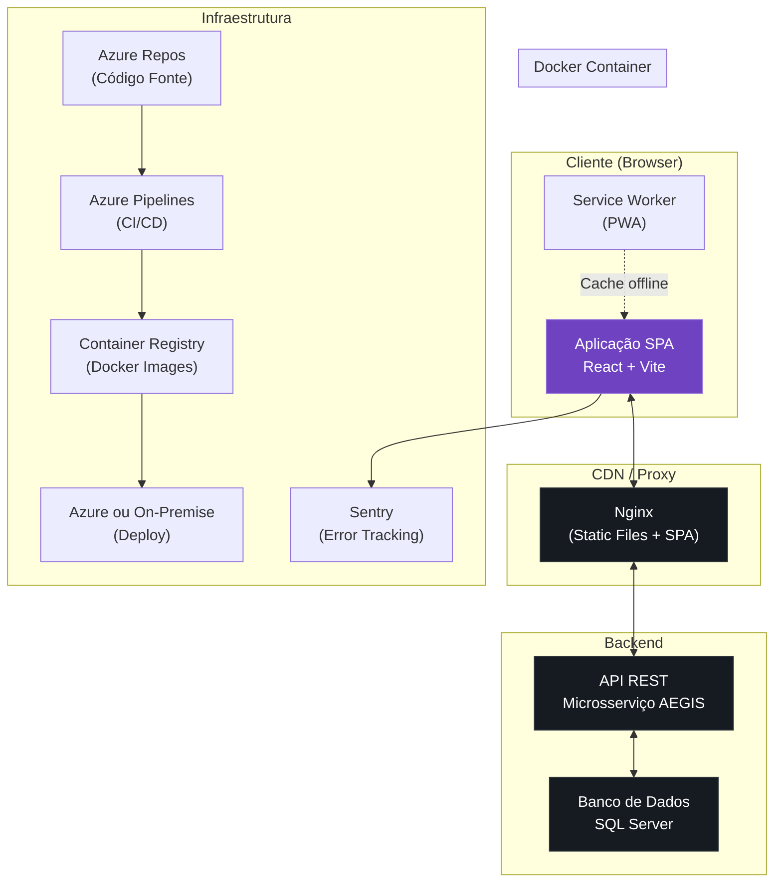

### 4.2 Padrões Arquiteturais

| Padrão                          | Aplicação                                   |
| ------------------------------- | ------------------------------------------- |
| **Feature-Based Architecture**  | Organização por módulos de funcionalidade   |
| **Clean Architecture**          | Separação em camadas (UI → Serviços → API)  |
| **SPA com Client-Side Routing** | React Router para navegação sem recarregar  |
| **Server State Management**     | TanStack Query para estado do servidor      |
| **Adapter Pattern**             | Camada de API abstrai implementação (Axios) |
| **Factory Pattern**             | Criação de componentes do design system     |
| **Strategy Pattern**            | Logging e error handling intercambiáveis    |
| **Observer Pattern**            | Notificações e eventos do sistema           |
| **Container/Presentational**    | Separação lógica de negócio da apresentação |

### 4.3 Fluxo de Dados

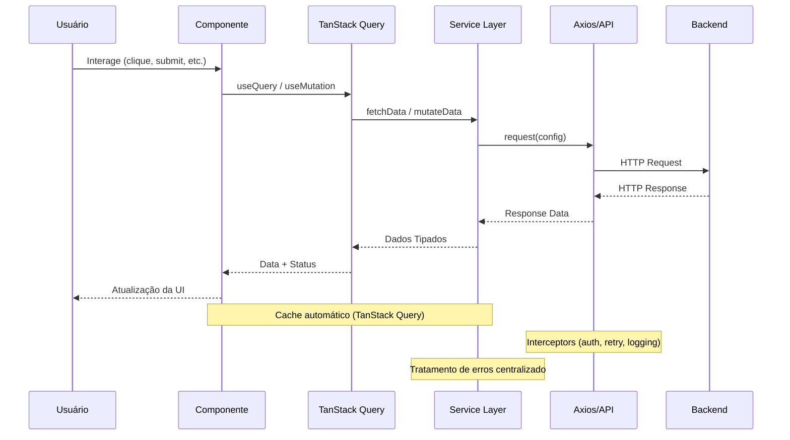

---

## 5. Estrutura de Pastas

```
aegis/
├── .azuredevops/
│   └── azure-pipelines.yml
├── .docker/
│   ├── nginx.conf
│   └── entrypoint.sh
├── .github/                    # Preparado para futuro (hoje Azure Repos)
├── public/
│   ├── favicon.ico
│   ├── manifest.json
│   ├── robots.txt
│   └── assets/
├── src/
│   ├── app/
│   │   ├── App.tsx
│   │   ├── main.tsx
│   │   └── providers.tsx
│   ├── assets/
│   │   ├── images/
│   │   └── fonts/
│   ├── components/             # Design System
│   │   ├── ui/                 # shadcn/ui components
│   │   │   ├── button.tsx
│   │   │   ├── card.tsx
│   │   │   ├── input.tsx
│   │   │   ├── select.tsx
│   │   │   ├── badge.tsx
│   │   │   ├── modal.tsx
│   │   │   ├── toast.tsx
│   │   │   ├── tooltip.tsx
│   │   │   ├── tabs.tsx
│   │   │   ├── skeleton.tsx
│   │   │   └── ...
│   │   ├── data-table/        # DataTable (virtualizada)
│   │   ├── layout/
│   │   │   ├── sidebar.tsx
│   │   │   ├── topbar.tsx
│   │   │   ├── breadcrumb.tsx
│   │   │   ├── main-layout.tsx
│   │   │   └── auth-layout.tsx  # Futuro
│   │   ├── shared/
│   │   │   ├── empty-state.tsx
│   │   │   ├── error-state.tsx
│   │   │   ├── loading-state.tsx
│   │   │   ├── search-box.tsx
│   │   │   ├── global-search.tsx
│   │   │   ├── page-header.tsx
│   │   │   ├── confirm-dialog.tsx
│   │   │   ├── upload-area.tsx
│   │   │   └── json-viewer.tsx
│   │   └── charts/            # Futuro (gráficos do dashboard)
│   ├── features/
│   │   ├── dashboard/
│   │   │   ├── components/
│   │   │   │   ├── dashboard-page.tsx
│   │   │   │   ├── stats-cards.tsx
│   │   │   │   ├── quick-actions.tsx
│   │   │   │   ├── recent-activity.tsx
│   │   │   │   ├── system-status.tsx
│   │   │   │   └── dashboard-skeleton.tsx
│   │   │   ├── hooks/
│   │   │   │   └── use-dashboard.ts
│   │   │   ├── services/
│   │   │   │   └── dashboard-api.ts
│   │   │   ├── types/
│   │   │   │   └── dashboard.types.ts
│   │   │   └── index.ts
│   │   ├── records/
│   │   │   ├── components/
│   │   │   │   ├── records-page.tsx
│   │   │   │   ├── records-table.tsx
│   │   │   │   ├── records-filters.tsx
│   │   │   │   ├── record-details-drawer.tsx
│   │   │   │   ├── record-form.tsx
│   │   │   │   ├── record-create-page.tsx
│   │   │   │   ├── record-edit-page.tsx
│   │   │   │   ├── record-delete-dialog.tsx
│   │   │   │   └── records-table-skeleton.tsx
│   │   │   ├── hooks/
│   │   │   │   ├── use-records.ts
│   │   │   │   ├── use-record.ts
│   │   │   │   └── use-record-mutations.ts
│   │   │   ├── services/
│   │   │   │   └── records-api.ts
│   │   │   ├── types/
│   │   │   │   └── records.types.ts
│   │   │   ├── utils/
│   │   │   │   └── records-utils.ts
│   │   │   └── index.ts
│   │   ├── locks/
│   │   │   ├── components/
│   │   │   │   ├── locks-page.tsx
│   │   │   │   ├── locks-table.tsx
│   │   │   │   ├── locks-filters.tsx
│   │   │   │   ├── lock-details-modal.tsx
│   │   │   │   ├── lock-disable-dialog.tsx
│   │   │   │   └── locks-table-skeleton.tsx
│   │   │   ├── hooks/
│   │   │   │   ├── use-locks.ts
│   │   │   │   └── use-lock-mutations.ts
│   │   │   ├── services/
│   │   │   │   └── locks-api.ts
│   │   │   ├── types/
│   │   │   │   └── locks.types.ts
│   │   │   └── index.ts
│   │   ├── import/
│   │   │   ├── components/
│   │   │   │   ├── import-page.tsx
│   │   │   │   ├── import-dropzone.tsx
│   │   │   │   ├── import-preview.tsx
│   │   │   │   ├── import-progress.tsx
│   │   │   │   ├── import-validation.tsx
│   │   │   │   ├── import-report.tsx
│   │   │   │   └── import-history.tsx
│   │   │   ├── hooks/
│   │   │   │   ├── use-import.ts
│   │   │   │   └── use-import-history.ts
│   │   │   ├── services/
│   │   │   │   ├── import-api.ts
│   │   │   │   └── import-parser.ts       # Isolado para futuro async
│   │   │   ├── types/
│   │   │   │   └── import.types.ts
│   │   │   ├── utils/
│   │   │   │   ├── csv-validator.ts
│   │   │   │   ├── xlsx-validator.ts
│   │   │   │   └── column-mapper.ts
│   │   │   └── index.ts
│   │   ├── execution-logs/
│   │   │   ├── components/
│   │   │   │   ├── execution-logs-page.tsx
│   │   │   │   ├── execution-logs-table.tsx
│   │   │   │   ├── execution-logs-filters.tsx
│   │   │   │   ├── execution-log-details-drawer.tsx
│   │   │   │   └── execution-logs-skeleton.tsx
│   │   │   ├── hooks/
│   │   │   │   └── use-execution-logs.ts
│   │   │   ├── services/
│   │   │   │   └── execution-logs-api.ts
│   │   │   ├── types/
│   │   │   │   └── execution-logs.types.ts
│   │   │   └── index.ts
│   │   └── monitoring/
│   │       ├── components/
│   │       │   ├── monitoring-page.tsx
│   │       │   ├── monitoring-timeline.tsx
│   │       │   ├── monitoring-filters.tsx
│   │       │   ├── monitoring-details.tsx
│   │       │   ├── monitoring-request-details.tsx
│   │       │   └── monitoring-skeleton.tsx
│   │       ├── hooks/
│   │       │   └── use-monitoring.ts
│   │       ├── services/
│   │       │   └── monitoring-api.ts
│   │       ├── types/
│   │       │   └── monitoring.types.ts
│   │       └── index.ts
│   ├── hooks/
│   │   ├── use-debounce.ts
│   │   ├── use-media-query.ts
│   │   ├── use-keyboard-shortcut.ts
│   │   ├── use-local-storage.ts
│   │   ├── use-intersection-observer.ts
│   │   ├── use-click-outside.ts
│   │   └── index.ts
│   ├── services/                 # Serviços globais
│   │   ├── http-client.ts        # Axios instance + interceptors
│   │   ├── retry-policy.ts
│   │   └── index.ts
│   ├── api/                      # Rotas de API (constantes)
│   │   ├── endpoints.ts
│   │   └── index.ts
│   ├── routes/
│   │   ├── index.tsx
│   │   ├── routes.ts            # Constantes de rotas
│   │   ├── protected-route.tsx   # Futuro (auth guard)
│   │   └── lazy-routes.ts       # Lazy loading routes
│   ├── providers/
│   │   ├── app-providers.tsx
│   │   ├── query-provider.tsx
│   │   ├── theme-provider.tsx
│   │   ├── toast-provider.tsx
│   │   └── auth-provider.tsx    # Futuro
│   ├── contexts/
│   │   ├── theme-context.ts
│   │   ├── sidebar-context.ts
│   │   ├── notification-context.ts  # Abstração (futuro WS/SSE)
│   │   └── auth-context.ts          # Futuro
│   ├── store/                     # Zustand (apenas UI state)
│   │   ├── sidebar-store.ts
│   │   ├── ui-store.ts
│   │   └── index.ts
│   ├── types/                     # Tipos globais
│   │   ├── api.types.ts           # Tipos genéricos de API
│   │   ├── common.types.ts
│   │   ├── pagination.types.ts
│   │   └── i18n.types.ts          # Preparado para i18n
│   ├── utils/
│   │   ├── cn.ts                  # clsx + tailwind-merge
│   │   ├── format.ts              # Formatadores (data, número, etc.)
│   │   ├── validators.ts          # Validações genéricas
│   │   ├── constants.ts
│   │   └── index.ts
│   ├── config/
│   │   ├── app.config.ts          # Config centralizada
│   │   ├── env.ts                 # Variáveis de ambiente
│   │   ├── feature-flags.ts       # Feature flags centralizadas
│   │   └── logger.config.ts       # Abstração de logging
│   ├── styles/
│   │   ├── globals.css
│   │   ├── themes.css
│   │   └── animations.css
│   ├── logging/                   # Abstração de logging
│   │   ├── logger.interface.ts
│   │   ├── console-logger.ts
│   │   ├── sentry-logger.ts       # Implementação Sentry
│   │   ├── logger-factory.ts
│   │   └── index.ts
│   ├── i18n/                      # Preparado para internacionalização
│   │   ├── types.ts
│   │   ├── pt-br.ts
│   │   ├── en.ts                  # Futuro
│   │   ├── es.ts                  # Futuro
│   │   └── index.ts
│   ├── mocks/                     # MSW - Mock Service Worker
│   │   ├── handlers/
│   │   │   ├── dashboard.ts
│   │   │   ├── records.ts
│   │   │   ├── locks.ts
│   │   │   ├── execution-logs.ts
│   │   │   └── monitoring.ts
│   │   ├── data/
│   │   │   ├── records.ts
│   │   │   ├── locks.ts
│   │   │   └── logs.ts
│   │   ├── browser.ts
│   │   └── server.ts
│   ├── test/                      # Setup de testes
│   │   ├── setup.ts
│   │   ├── test-utils.tsx
│   │   └── mocks.ts
│   └── stories/                   # Storybook
│       ├── Button.stories.tsx
│       ├── Card.stories.tsx
│       ├── DataTable.stories.tsx
│       └── ...
├── plop-templates/                # Plop.js generators
│   ├── feature/
│   │   ├── index.ts.hbs
│   │   ├── types.ts.hbs
│   │   ├── services.ts.hbs
│   │   ├── hooks.ts.hbs
│   │   └── components.tsx.hbs
│   └── component/
│       ├── component.tsx.hbs
│       └── stories.tsx.hbs
├── .changeset/                    # Changesets config
├── .storybook/
│   ├── main.ts
│   └── preview.ts
├── Dockerfile
├── docker-compose.yml
├── .dockerignore
├── azure-pipelines.yml
├── .env.example
├── .env.development
├── .env.production
├── index.html
├── vite.config.ts
├── tsconfig.json
├── tsconfig.node.json
├── tailwind.config.ts
├── postcss.config.js
├── eslint.config.js
├── .prettierrc
├── .lintstagedrc.json
├── plopfile.js                   # Plop.js configuration
├── vitest.config.ts
├── playwright.config.ts
├── CONTRIBUTING.md
└── README.md
```

---

## 6. Detalhamento dos Módulos

### 6.1 Dashboard

**Propósito:** Visão executiva do sistema com indicadores-chave.

**Componentes:**

| Componente          | Descrição                                                  |
| ------------------- | ---------------------------------------------------------- |
| `StatsCards`        | Grid de cards com KPIs (total fichas, travas ativas, etc.) |
| `QuickActions`      | Botões de ação rápida (nova ficha, importar, etc.)         |
| `RecentActivity`    | Tabela/lista de atividades recentes                        |
| `SystemStatus`      | Indicador de saúde do sistema                              |
| `DashboardSkeleton` | Estado de carregamento                                     |

**Dados consumidos:**

- `GET /api/v1/dashboard/summary` → KPIs
- `GET /api/v1/dashboard/recent-activity` → Atividades recentes
- `GET /api/v1/health` → Status do sistema

### 6.2 Records (Fichas)

**Propósito:** Gerenciamento completo de fichas de incidentes.

**Componentes:**

| Componente            | Descrição                                     |
| --------------------- | --------------------------------------------- |
| `RecordsPage`         | Página principal com listagem                 |
| `RecordsTable`        | Tabela virtualizada com paginação server-side |
| `RecordsFilters`      | Painel de filtros avançados                   |
| `RecordDetailsDrawer` | Drawer lateral com detalhes                   |
| `RecordForm`          | Formulário reutilizável (criar/editar)        |
| `RecordCreatePage`    | Página de criação                             |
| `RecordEditPage`      | Página de edição                              |
| `RecordDeleteDialog`  | Diálogo de confirmação de exclusão            |

**Dados consumidos:**

- `GET /api/v1/fichas` → Lista paginada
- `GET /api/v1/fichas/:id` → Detalhes
- `POST /api/v1/fichas` → Criar
- `PUT /api/v1/fichas/:id` → Atualizar
- `DELETE /api/v1/fichas/:id` → Excluir

### 6.3 Locks (Travas)

**Propósito:** Gerenciamento de travas ativas.

**Componentes:**

| Componente          | Descrição                  |
| ------------------- | -------------------------- |
| `LocksPage`         | Página principal           |
| `LocksTable`        | Tabela de travas ativas    |
| `LocksFilters`      | Filtros avançados          |
| `LockDetailsModal`  | Modal de detalhes          |
| `LockDisableDialog` | Confirmação de desativação |

**Dados consumidos:**

- `GET /api/v1/travas` → Lista paginada
- `GET /api/v1/travas/:id` → Detalhes
- `POST /api/v1/travas/:id/disable` → Desativar trava

### 6.4 Import

**Propósito:** Importação em lote de fichas.

**Componentes:**

| Componente         | Descrição                      |
| ------------------ | ------------------------------ |
| `ImportPage`       | Página principal de importação |
| `ImportDropzone`   | Área de drag & drop            |
| `ImportPreview`    | Preview dos dados do arquivo   |
| `ImportProgress`   | Barra de progresso             |
| `ImportValidation` | Validação de dados             |
| `ImportReport`     | Relatório de importação        |
| `ImportHistory`    | Histórico de importações       |

**Dados consumidos:**

- `POST /api/v1/import/upload` → Upload do arquivo
- `GET /api/v1/import/:id/status` → Status da importação
- `GET /api/v1/import/:id/report` → Relatório
- `GET /api/v1/import/history` → Histórico

### 6.5 Execution Logs

**Propósito:** Visualização de logs de execução (read-only).

**Componentes:**

| Componente                  | Descrição                          |
| --------------------------- | ---------------------------------- |
| `ExecutionLogsPage`         | Página principal                   |
| `ExecutionLogsTable`        | Tabela de logs                     |
| `ExecutionLogsFilters`      | Filtros                            |
| `ExecutionLogDetailsDrawer` | Drawer de detalhes com JSON viewer |

**Dados consumidos:**

- `GET /api/v1/logs/execucao` → Lista paginada
- `GET /api/v1/logs/execucao/:id` → Detalhes

### 6.6 Monitoring

**Propósito:** Visualização de logs de monitoramento (read-only).

**Componentes:**

| Componente                 | Descrição                           |
| -------------------------- | ----------------------------------- |
| `MonitoringPage`           | Página principal                    |
| `MonitoringTimeline`       | Timeline de eventos                 |
| `MonitoringFilters`        | Filtros                             |
| `MonitoringDetails`        | Detalhes do evento                  |
| `MonitoringRequestDetails` | Detalhes da requisição (colapsável) |

**Dados consumidos:**

- `GET /api/v1/monitoring/logs` → Lista paginada
- `GET /api/v1/monitoring/logs/:id` → Detalhes

---

## 7. Hierarquia de Componentes

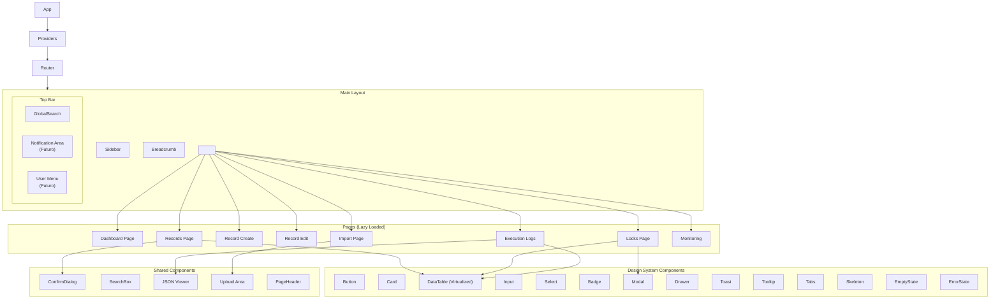

---

## 8. Estratégia de Rotas

### 8.1 Definição de Rotas (MVP)

| Caminho             | Componente          | Módulo         | Lazy |
| ------------------- | ------------------- | -------------- | ---- |
| `/`                 | `DashboardPage`     | Dashboard      | Sim  |
| `/records`          | `RecordsPage`       | Records        | Sim  |
| `/records/new`      | `RecordCreatePage`  | Records        | Sim  |
| `/records/:id/edit` | `RecordEditPage`    | Records        | Sim  |
| `/locks`            | `LocksPage`         | Locks          | Sim  |
| `/import`           | `ImportPage`        | Import         | Sim  |
| `/logs/execution`   | `ExecutionLogsPage` | Execution Logs | Sim  |
| `/monitoring`       | `MonitoringPage`    | Monitoring     | Sim  |

### 8.2 Definição de Rotas (Futuro)

| Caminho          | Componente          | Módulo        | Protegida     |
| ---------------- | ------------------- | ------------- | ------------- |
| `/login`         | `LoginPage`         | Auth          | Não           |
| `/auth/callback` | `AuthCallbackPage`  | Auth          | Não           |
| `/admin/users`   | `UsersPage`         | Admin         | Sim (Admin)   |
| `/admin/roles`   | `RolesPage`         | Admin         | Sim (Admin)   |
| `/admin/config`  | `ConfigPage`        | Admin         | Sim (Admin)   |
| `/audit`         | `AuditPage`         | Audit         | Sim (Auditor) |
| `/reports`       | `ReportsPage`       | Reports       | Sim           |
| `/settings`      | `SettingsPage`      | Settings      | Sim           |
| `/notifications` | `NotificationsPage` | Notifications | Sim           |

### 8.3 Configuração de Rotas

```typescript
// routes/routes.ts - Constantes de rotas
export const ROUTES = {
  DASHBOARD: '/',
  RECORDS: {
    LIST: '/records',
    NEW: '/records/new',
    EDIT: '/records/:id/edit',
  },
  LOCKS: {
    LIST: '/locks',
  },
  IMPORT: '/import',
  LOGS: {
    EXECUTION: '/logs/execution',
  },
  MONITORING: '/monitoring',
  // Futuro
  AUTH: {
    LOGIN: '/login',
    CALLBACK: '/auth/callback',
  },
  ADMIN: {
    USERS: '/admin/users',
    ROLES: '/admin/roles',
    CONFIG: '/admin/config',
  },
} as const;
```

### 8.4 Lazy Loading

Todas as rotas de funcionalidade usarão `React.lazy()` + `Suspense`:

```typescript
// routes/lazy-routes.ts
const DashboardPage = lazy(() => import('@features/dashboard/components/dashboard-page'));
const RecordsPage = lazy(() => import('@features/records/components/records-page'));
// ...

// Componente de loading para Suspense
const PageLoader = () => <div className="flex items-center justify-center h-screen">
  <LoadingSpinner size="lg" />
</div>;
```

---

## 9. Estratégia de Integração com API

### 9.1 Camada HTTP

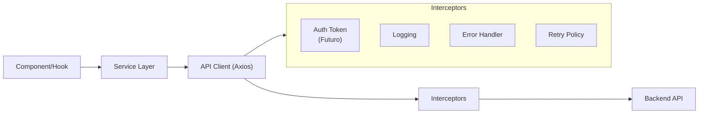

### 9.2 Configuração do Axios

```typescript
// services/http-client.ts
const httpClient = axios.create({
  baseURL: config.api.baseUrl, // Environment-based
  timeout: config.api.timeout,
  headers: { 'Content-Type': 'application/json' },
});

// Request interceptor
httpClient.interceptors.request.use((config) => {
  logger.debug(`[API] ${config.method?.toUpperCase()} ${config.url}`);
  // Futuro: adicionar token de autenticação
  return config;
});

// Response interceptor
httpClient.interceptors.response.use(
  (response) => response,
  (error) => {
    const handledError = errorHandler(error);
    logger.error('[API] Error', handledError);
    return Promise.reject(handledError);
  },
);
```

### 9.3 Retry Policy

```typescript
// services/retry-policy.ts
export const retryPolicy = {
  retries: 3,
  retryDelay: (attempt: number) => Math.min(1000 * 2 ** attempt, 10000),
  retryCondition: (error: AxiosError) => {
    // Retry apenas em erros de rede ou 5xx
    return !error.response || error.response.status >= 500;
  },
};
```

### 9.4 Endpoints Centralizados

```typescript
// api/endpoints.ts
export const API_ENDPOINTS = {
  DASHBOARD: {
    SUMMARY: '/api/v1/dashboard/summary',
    RECENT_ACTIVITY: '/api/v1/dashboard/recent-activity',
  },
  FICHAS: {
    LIST: '/api/v1/fichas',
    DETAILS: (id: string) => `/api/v1/fichas/${id}`,
    CREATE: '/api/v1/fichas',
    UPDATE: (id: string) => `/api/v1/fichas/${id}`,
    DELETE: (id: string) => `/api/v1/fichas/${id}`,
  },
  TRAVAS: {
    LIST: '/api/v1/travas',
    DETAILS: (id: string) => `/api/v1/travas/${id}`,
    DISABLE: (id: string) => `/api/v1/travas/${id}/disable`,
  },
  IMPORT: {
    UPLOAD: '/api/v1/import/upload',
    STATUS: (id: string) => `/api/v1/import/${id}/status`,
    REPORT: (id: string) => `/api/v1/import/${id}/report`,
    HISTORY: '/api/v1/import/history',
  },
  LOGS: {
    EXECUTION: '/api/v1/logs/execucao',
    EXECUTION_DETAILS: (id: string) => `/api/v1/logs/execucao/${id}`,
  },
  MONITORING: {
    LOGS: '/api/v1/monitoring/logs',
    DETAILS: (id: string) => `/api/v1/monitoring/logs/${id}`,
  },
  HEALTH: '/api/v1/health',
} as const;
```

### 9.5 Service Layer Pattern

Cada feature tem seu próprio service, que encapsula chamadas à API:

```typescript
// features/records/services/records-api.ts
export const recordsApi = {
  list: (params: RecordListParams): Promise<PaginatedResponse<Record>> =>
    httpClient.get(API_ENDPOINTS.FICHAS.LIST, { params }).then((r) => r.data),

  getById: (id: string): Promise<Record> =>
    httpClient.get(API_ENDPOINTS.FICHAS.DETAILS(id)).then((r) => r.data),

  create: (data: CreateRecordPayload): Promise<Record> =>
    httpClient.post(API_ENDPOINTS.FICHAS.CREATE, data).then((r) => r.data),

  update: (id: string, data: UpdateRecordPayload): Promise<Record> =>
    httpClient.put(API_ENDPOINTS.FICHAS.UPDATE(id), data).then((r) => r.data),

  delete: (id: string): Promise<void> =>
    httpClient.delete(API_ENDPOINTS.FICHAS.DELETE(id)).then((r) => r.data),
};
```

### 9.6 Cancelamento de Requisições

Uso de `AbortSignal` para cancelar requisições quando o componente desmonta ou o usuário navega:

```typescript
// hooks/use-records.ts
function useRecords(params: RecordListParams) {
  return useQuery({
    queryKey: ['records', params],
    queryFn: ({ signal }) => recordsApi.list({ ...params, signal }),
    placeholderData: keepPreviousData,
  });
}
```

---

## 10. Estratégia de Gerenciamento de Estado

### 10.1 Categorias de Estado

| Tipo             | Descrição                                      | Tecnologia     |
| ---------------- | ---------------------------------------------- | -------------- |
| **Server State** | Dados vindos do backend (fichas, travas, logs) | TanStack Query |
| **Client State** | Dados do usuário, preferências                 | Context API    |
| **UI State**     | Sidebar aberta/fechada, modal ativo            | Zustand        |

### 10.2 TanStack Query (Estado do Servidor)

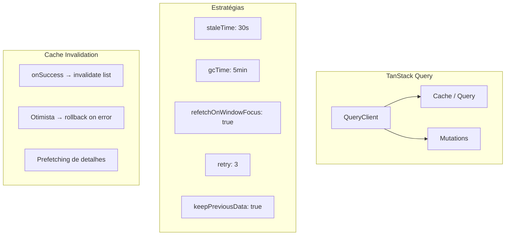

**Configuração global:**

```typescript
const queryClient = new QueryClient({
  defaultOptions: {
    queries: {
      staleTime: 30 * 1000, // 30s antes de considerar obsoleto
      gcTime: 5 * 60 * 1000, // 5min no cache
      retry: 3,
      refetchOnWindowFocus: true,
      refetchOnReconnect: true,
    },
    mutations: {
      retry: 0,
    },
  },
});
```

### 10.3 Zustand (UI State)

Apenas para estado de UI que não é server state nem vale a pena contexto do React:

```typescript
// store/sidebar-store.ts
interface SidebarState {
  isOpen: boolean;
  isCollapsed: boolean;
  toggle: () => void;
  collapse: () => void;
  expand: () => void;
}

export const useSidebarStore = create<SidebarState>((set) => ({
  isOpen: true,
  isCollapsed: false,
  toggle: () => set((state) => ({ isOpen: !state.isOpen })),
  collapse: () => set({ isCollapsed: true }),
  expand: () => set({ isCollapsed: false }),
}));
```

### 10.4 Context API (Client State)

Para estado compartilhado que não é server state mas precisa ser acessado por múltiplos componentes:

- `ThemeContext` → Tema claro/escuro
- `SidebarContext` → Estado da sidebar
- `NotificationContext` → Abstração para notificações (preparado para WebSocket/SSE futuro)

---

## 11. Especificação do Design System

### 11.1 Tema

```css
/* Design Tokens (CSS Variables) */
:root {
  /* Primary */
  --color-primary: #6f42c1;
  --color-primary-hover: #8b63d4;
  --color-primary-light: #a78bfa;

  /* Background */
  --color-bg-primary: #0d1117;
  --color-bg-surface: #161b22;
  --color-bg-elevated: #1c2128;

  /* Borders */
  --color-border: #30363d;
  --color-border-light: #21262d;

  /* Text */
  --color-text-primary: #e6edf3;
  --color-text-secondary: #8b949e;
  --color-text-muted: #6e7681;

  /* Semantic */
  --color-success: #2ea043;
  --color-warning: #d29922;
  --color-danger: #f85149;
  --color-info: #58a6ff;

  /* Typography */
  --font-family: 'Inter', -apple-system, BlinkMacSystemFont, sans-serif;
  --font-mono: 'JetBrains Mono', 'Fira Code', monospace;

  /* Spacing */
  --spacing-xs: 4px;
  --spacing-sm: 8px;
  --spacing-md: 16px;
  --spacing-lg: 24px;
  --spacing-xl: 32px;
  --spacing-2xl: 48px;

  /* Radius */
  --radius-sm: 4px;
  --radius-md: 8px;
  --radius-lg: 12px;
  --radius-xl: 16px;

  /* Shadows */
  --shadow-sm: 0 1px 2px rgba(0, 0, 0, 0.3);
  --shadow-md: 0 4px 6px rgba(0, 0, 0, 0.4);
  --shadow-lg: 0 10px 15px rgba(0, 0, 0, 0.5);
  --shadow-glow: 0 0 20px rgba(111, 66, 193, 0.15);
}
```

### 11.2 Componentes do Design System

| Componente       | Status | Descrição                                                                                  |
| ---------------- | ------ | ------------------------------------------------------------------------------------------ |
| `Button`         | MVP    | Múltiplos variantes (primary, secondary, ghost, danger, outline), sizes, loading, disabled |
| `Card`           | MVP    | Container com padding, border, shadow, hover effects                                       |
| `Input`          | MVP    | Text input com label, error, helper text, icon                                             |
| `Textarea`       | MVP    | Multiline input com resize control                                                         |
| `Select`         | MVP    | Native select estilizado ou combobox                                                       |
| `Checkbox`       | MVP    | Checkbox estilizado com label                                                              |
| `Radio`          | MVP    | Radio group estilizado                                                                     |
| `Badge`          | MVP    | Status badge (success, warning, danger, info, neutral)                                     |
| `Alert`          | MVP    | Alertas informativos, erro, warning, sucesso                                               |
| `Modal`          | MVP    | Modal com backdrop, foco, fechar com ESC                                                   |
| `Drawer`         | MVP    | Painel lateral (direita)                                                                   |
| `Dialog`         | MVP    | Diálogo de confirmação                                                                     |
| `Toast`          | MVP    | Notificações toast (sucesso, erro, info, warning)                                          |
| `Tooltip`        | MVP    | Tooltip com posicionamento                                                                 |
| `Dropdown`       | MVP    | Menu dropdown com items e separadores                                                      |
| `Tabs`           | MVP    | Navegação por abas                                                                         |
| `Accordion`      | MVP    | Expansão/colapso de conteúdo                                                               |
| `Pagination`     | MVP    | Paginação server-side                                                                      |
| `DataTable`      | MVP    | Tabela virtualizada com sort, filter, paginação                                            |
| `SearchBox`      | MVP    | Input de busca com debounce                                                                |
| `ProgressBar`    | MVP    | Barra de progresso (importação)                                                            |
| `LoadingSpinner` | MVP    | Spinner de carregamento                                                                    |
| `Skeleton`       | MVP    | Skeleton loader para conteúdo                                                              |
| `EmptyState`     | MVP    | Estado vazio com ícone e ação                                                              |
| `ErrorState`     | MVP    | Estado de erro com retry                                                                   |
| `UploadArea`     | MVP    | Drag & drop com validação                                                                  |
| `DatePicker`     | MVP    | Seletor de data (usando biblioteca leve)                                                   |
| `Breadcrumb`     | MVP    | Navegação breadcrumb                                                                       |
| `JsonViewer`     | MVP    | Visualizador JSON com syntax highlighting                                                  |

### 11.3 DataTable (Tabela Virtualizada)

A `DataTable` é o componente mais crítico do sistema. Deve suportar:

- **Virtualização** via TanStack Virtual para performance com milhares de linhas
- **Paginação server-side** com controles de página
- **Ordenação** por coluna (server-side)
- **Seleção** de linhas (checkbox)
- **Visibilidade** de colunas
- **Responsividade** com scroll horizontal
- **Estado vazio** e **loading skeleton**
- **Altura automática** para ocupar o espaço disponível

```typescript
interface DataTableProps<T> {
  data: T[];
  columns: ColumnDef<T>[];
  pagination: PaginationState;
  onPaginationChange: (pagination: PaginationState) => void;
  sorting: SortingState;
  onSortingChange: (sorting: SortingState) => void;
  totalCount: number;
  isLoading: boolean;
  isError: boolean;
  emptyMessage?: string;
  onRowClick?: (row: T) => void;
  columnVisibility?: Record<string, boolean>;
  onColumnVisibilityChange?: (visibility: Record<string, boolean>) => void;
}
```

---

## 12. Diretrizes de UI/UX

### 12.1 Princípios de Design

| Princípio             | Descrição                                     |
| --------------------- | --------------------------------------------- |
| **Clareza**           | Interfaces auto-explicativas, sem ambiguidade |
| **Eficiência**        | Mínimo de cliques para完成任务                |
| **Consistência**      | Mesmos padrões em toda aplicação              |
| **Feedback**          | Toda ação gera feedback visual                |
| **Recuperação**       | Erros são recuperáveis, undo quando possível  |
| **Proximidade**       | Informações relacionadas agrupadas            |
| **Hierarquia Visual** | Dados mais importantes em destaque            |

### 12.2 Padrões de Interação

| Padrão              | Comportamento                          |
| ------------------- | -------------------------------------- |
| **Loading inicial** | Skeleton loader (não spinner)          |
| **Ações de submit** | Button com loading state, desabilitado |
| **Sucesso**         | Toast verde, automático, 4s            |
| **Erro**            | Toast vermelho, persistente até fechar |
| **Delete**          | Confirmação obrigatória (Dialog)       |
| **Navegação**       | Transição suave entre páginas          |
| **Busca**           | Debounce de 300ms                      |
| **Tooltip**         | 200ms delay para aparecer              |
| **Modal**           | Fechar com ESC, clique no backdrop     |
| **Drawer**          | Fechar com ESC, swipe em mobile        |

### 12.3 Micro-Interações

- Hover em cards com leve elevação
- Transições de página com fade (100ms)
- Botões com feedback de clique (scale 0.97)
- Notificações com slide-in animado
- Skeleton com shimmer animation

---

## 13. Comportamento Responsivo

### 13.1 Breakpoints

| Breakpoint | Largura | Layout             |
| ---------- | ------- | ------------------ |
| `sm`       | 640px+  | Mobile landscape   |
| `md`       | 768px+  | Tablet             |
| `lg`       | 1024px+ | Desktop            |
| `xl`       | 1280px+ | Desktop wide       |
| `2xl`      | 1536px+ | Desktop ultra-wide |

### 13.2 Adaptações por Tela

| Elemento  | Mobile (<768px)   | Tablet (768-1024px)  | Desktop (>1024px)      |
| --------- | ----------------- | -------------------- | ---------------------- |
| Sidebar   | Hidden (overlay)  | Collapsible (ícones) | Expandida              |
| Topbar    | Título + menu     | Título + ações       | Título + busca + ações |
| DataTable | Scroll horizontal | Scroll horizontal    | Normal                 |
| Cards     | 1 coluna          | 2 colunas            | 4 colunas              |
| Filters   | Modal/Collapse    | Painel lateral       | Inline                 |
| Drawer    | Full screen       | 70% largura          | 50% largura            |
| Modals    | Full screen       | Centralizado         | Centralizado           |
| Forms     | Single column     | Single column        | 2 columns              |

### 13.3 Navegação Mobile

- Sidebar substituída por bottom sheet ou drawer do topo
- Busca global com atalho acionável por ícone
- Ações principais em FAB (Floating Action Button)

---

## 14. Estratégia de Tratamento de Erros

### 14.1 Hierarquia de Erros

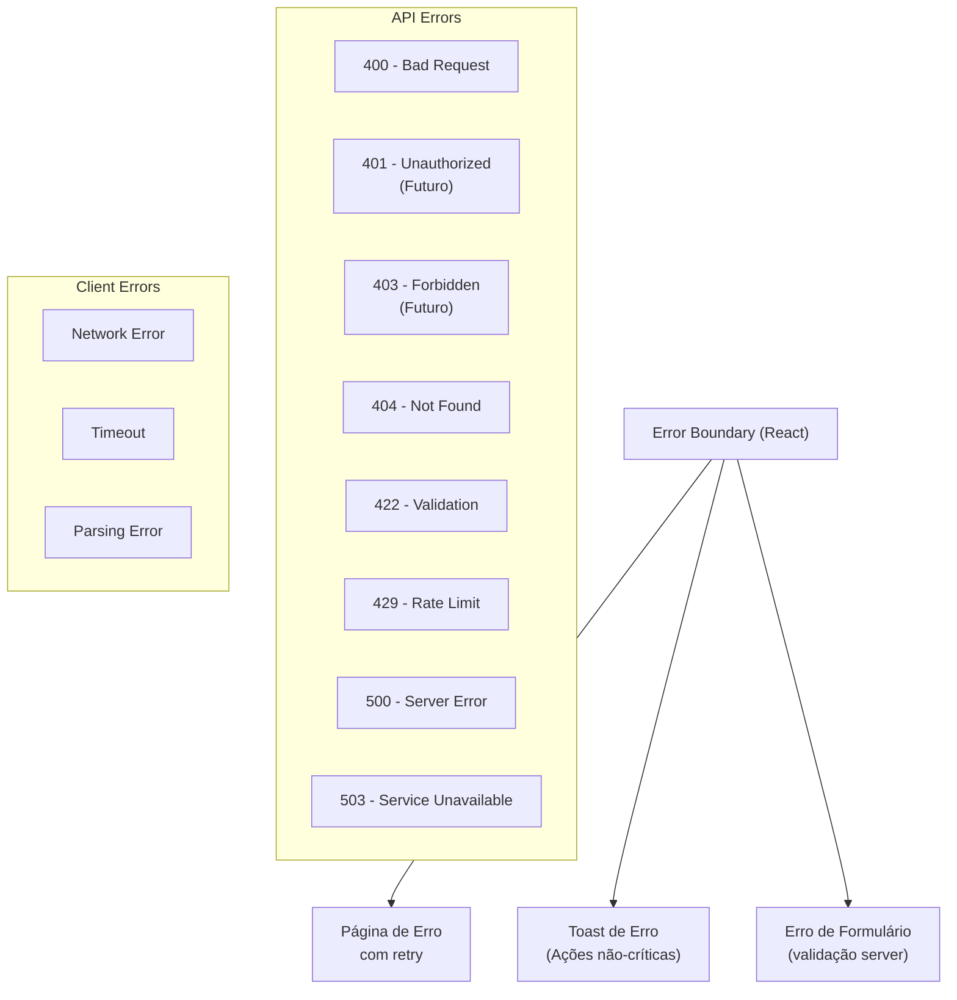

### 14.2 Tratamento por Categoria

| Categoria                | Ação                                | UI                  |
| ------------------------ | ----------------------------------- | ------------------- |
| Erro de rede             | Retry automático (3x), depois toast | Toast + botão retry |
| 4xx (exceto auth)        | Toast com mensagem do servidor      | Toast               |
| 5xx                      | Toast genérico + log Sentry         | Toast + ErrorState  |
| Timeout                  | Abortar requisição, toast           | Toast               |
| Erro de validação        | Exibir erros no formulário          | Inline error        |
| Erro crítico (app crash) | Error Boundary                      | Página de erro      |
| Rota não encontrada      | 404 page                            | Página 404          |

### 14.3 Error Boundary

```typescript
// components/shared/error-boundary.tsx
class ErrorBoundary extends React.Component<ErrorBoundaryProps, ErrorBoundaryState> {
  // Captura erros de renderização
  // Mostra ErrorState com botão de retry
  // Loga no Sentry
  // Previne crash total da aplicação
}
```

### 14.4 Centralized Error Handler

```typescript
// services/http-client.ts
function errorHandler(error: AxiosError): AppError {
  if (error.code === 'ERR_NETWORK') {
    return { type: 'NETWORK', message: 'Falha de conexão', retry: true };
  }
  if (error.code === 'ECONNABORTED') {
    return { type: 'TIMEOUT', message: 'Tempo limite excedido', retry: true };
  }
  if (error.response) {
    switch (error.response.status) {
      case 404:
        return { type: 'NOT_FOUND', message: 'Recurso não encontrado' };
      case 422:
        return { type: 'VALIDATION', errors: error.response.data.errors };
      case 500:
        return { type: 'SERVER', message: 'Erro interno do servidor' };
      // Futuro: 401/403
    }
  }
  return { type: 'UNKNOWN', message: 'Erro desconhecido' };
}
```

---

## 15. Estratégia de Performance

### 15.1 Metas de Performance

| Métrica                        | Meta    |
| ------------------------------ | ------- |
| First Contentful Paint (FCP)   | < 1.5s  |
| Largest Contentful Paint (LCP) | < 2.5s  |
| Time to Interactive (TTI)      | < 3.0s  |
| Bundle Size (gzip)             | < 150KB |
| Lighthouse Performance         | > 90    |
| Lighthouse Accessibility       | > 90    |
| Lighthouse Best Practices      | > 90    |

### 15.2 Técnicas de Performance

| Técnica                   | Aplicação                                   |
| ------------------------- | ------------------------------------------- |
| **Code Splitting**        | `React.lazy()` por rota                     |
| **Tree Shaking**          | Vite já faz, imports nomeados               |
| **Lazy Loading**          | Componentes abaixo da dobra                 |
| **Virtualização**         | TanStack Virtual para tabelas (DataTable)   |
| **Memoization**           | `React.memo`, `useMemo`, `useCallback`      |
| **Debouncing**            | Busca (300ms), resize (150ms)               |
| **Request Deduplication** | TanStack Query (mesma queryKey = 1 request) |
| **Caching**               | TanStack Query (gcTime configurável)        |
| **Cancelable Requests**   | `AbortSignal`                               |
| **Image Optimization**    | SVGs para ícones, WebP para imagens         |
| **Bundle Analysis**       | `rollup-plugin-visualizer`                  |
| **Font Loading**          | `font-display: swap` para Inter             |
| **Preload/Prefetch**      | Prefetch de rotas próximas                  |

### 15.3 Otimizações de Bundle

```typescript
// vite.config.ts - Otimizações
export default defineConfig({
  build: {
    rollupOptions: {
      output: {
        manualChunks: {
          vendor: ['react', 'react-dom', 'react-router-dom'],
          query: ['@tanstack/react-query'],
          table: ['@tanstack/react-table', '@tanstack/react-virtual'],
          forms: ['react-hook-form', '@hookform/resolvers', 'zod'],
          xlsx: ['xlsx'], // Carregado apenas na importação
          csv: ['papaparse'], // Carregado apenas na importação
        },
      },
    },
    target: 'es2020',
    sourcemap: false,
    minify: 'terser',
  },
});
```

### 15.4 Performance da DataTable

A tabela de fichas é o componente de maior carga. Estratégias:

1. **Virtualização**: Apenas linhas visíveis são renderizadas no DOM
2. **Pagination**: Server-side (nunca carregar tudo)
3. **Columnas fixas**: ID e ações fixas, resto scrollável
4. **Throttle de resize**: Recalcular virtualização apenas após resize
5. **Sem renderização condicional complexa**: Linhas são simples
6. **key adequado**: `row.id` para evitar re-renderizações desnecessárias

---

## 16. Estratégia de Acessibilidade

### 16.1 Conformidade

Meta: **WCAG 2.1 AA** (nível A obrigatório, AA como padrão).

### 16.2 Diretrizes por Componente

| Componente  | Requisitos WCAG                                                |
| ----------- | -------------------------------------------------------------- |
| Botões      | Foco visível, role="button", aria-label quando sem texto       |
| Inputs      | `<label>` associado, aria-describedby para erros               |
| Modal       | Focus trap, role="dialog", aria-modal, fechar ESC              |
| Drawer      | Focus trap, role="dialog", aria-label                          |
| DataTable   | `<caption>`, th com scope, sort indicadores aria-sort          |
| Tabs        | role="tablist", role="tab", aria-selected, keyboard navigation |
| Toast       | role="alert", aria-live="polite"                               |
| Tooltip     | role="tooltip", aria-describedby                               |
| Navegação   | Skip to content, landmarks (nav, main, aside)                  |
| Formulários | Error summary, aria-invalid, aria-describedby                  |

### 16.3 Navegação por Teclado

| Atalho             | Ação                                |
| ------------------ | ----------------------------------- |
| `Ctrl+K` / `Cmd+K` | Busca global                        |
| `Escape`           | Fechar modal/drawer/dropdown        |
| `Tab`              | Navegar entre elementos focáveis    |
| `Shift+Tab`        | Navegar reverso                     |
| `Enter` / `Space`  | Ativar elemento focado              |
| `Arrow Keys`       | Navegar em tabelas, tabs, dropdowns |
| `?`                | Mostrar atalhos de teclado          |

### 16.4 Contrast Ratio

| Combinação           | Ratio mínimo | Nosso tema                                   |
| -------------------- | ------------ | -------------------------------------------- |
| Texto normal × fundo | 4.5:1        | Texto `#E6EDF3` × fundo `#0D1117` = 13.2:1 ✓ |
| Texto grande × fundo | 3:1          | OK                                           |
| Componentes × fundo  | 3:1          | OK                                           |
| Links no texto       | 3:1          | `#58A6FF` × `#0D1117` = 6.8:1 ✓              |

---

## 17. Considerações de Segurança

### 17.1 Content Security Policy (CSP)

```nginx
# nginx.conf
add_header Content-Security-Policy "
    default-src 'self';
    script-src 'self';
    style-src 'self' 'unsafe-inline';
    img-src 'self' data:;
    font-src 'self';
    connect-src 'self' https://api.aegis.internal;
    frame-ancestors 'none';
    base-uri 'self';
    form-action 'self';
" always;
```

### 17.2 Outras Medidas

| Medida                      | Implementação                                  |
| --------------------------- | ---------------------------------------------- |
| **CSP Headers**             | Nginx + meta tag fallback                      |
| **X-Content-Type-Options**  | `nosniff` via Nginx                            |
| **X-Frame-Options**         | `DENY` via Nginx                               |
| **Referrer-Policy**         | `strict-origin-when-cross-origin`              |
| **Sanitização de input**    | Zod validation + XSS sanitization              |
| **HTTPS apenas**            | Produção obrigatório                           |
| **Sem exposição de tokens** | Preparado para HTTP-only cookies (futuro auth) |
| **Dependências seguras**    | `npm audit` no pipeline                        |
| **SBOM**                    | Geração de Bill of Materials no CI             |

### 17.3 Headers de Segurança (Nginx)

```nginx
add_header X-Content-Type-Options "nosniff" always;
add_header X-Frame-Options "DENY" always;
add_header X-XSS-Protection "1; mode=block" always;
add_header Referrer-Policy "strict-origin-when-cross-origin" always;
add_header Permissions-Policy "camera=(), microphone=(), geolocation=()" always;
```

---

## 18. Arquitetura Futura de Autenticação

### 18.1 Abstração Preparada

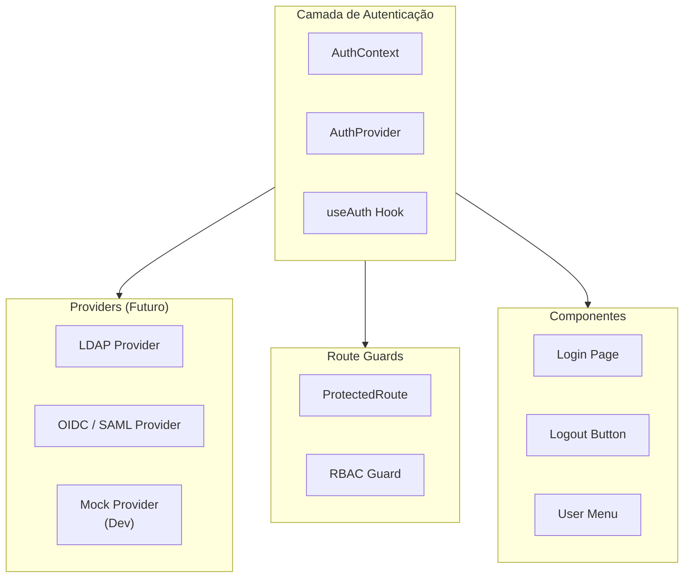

### 18.2 Auth Provider Strategy

```typescript
// providers/auth-provider.tsx (preparado para futuro)
interface AuthProvider {
  login(credentials: Credentials): Promise<AuthResult>;
  logout(): Promise<void>;
  getToken(): Promise<string | null>;
  getUser(): Promise<User | null>;
  isAuthenticated(): boolean;
}

// O AuthProvider consumirá o provider configurado
// sem que os componentes precisem saber qual é
```

### 18.3 Estrutura Preparada

- `contexts/auth-context.ts` — Contexto com interface definida
- `providers/auth-provider.tsx` — Provider que aceita strategy
- `routes/protected-route.tsx` — Guard de rota
- `components/auth/` — Componentes de login/logout
- `services/auth-api.ts` — API de autenticação

---

## 19. Arquitetura RBAC

### 19.1 Modelo de Permissões

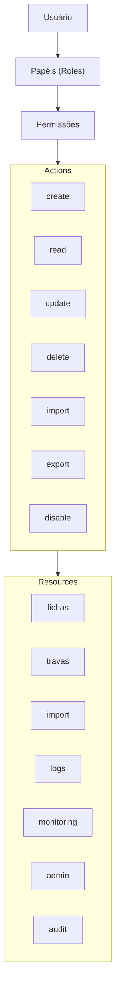

### 19.2 Estrutura Preparada

```typescript
// types/rbac.types.ts (preparado para futuro)
interface Role {
  id: string;
  name: string;
  permissions: Permission[];
}

interface Permission {
  resource: Resource;
  actions: Action[];
}

type Resource = 'fichas' | 'travas' | 'import' | 'logs' | 'monitoring' | 'admin';
type Action = 'create' | 'read' | 'update' | 'delete' | 'import' | 'disable';

// hooks/use-authorization.ts (preparado)
function useAuthorization() {
  const can = (action: Action, resource: Resource): boolean => {
    // Verificação de permissão
  };
  return { can };
}

// Componente condicional (preparado)
function Authorized({
  action,
  resource,
  children,
  fallback = null,
}: AuthorizedProps) {
  const { can } = useAuthorization();
  if (!can(action, resource)) return fallback;
  return <>{children}</>;
}
```

---

## 20. Arquitetura de Auditoria

### 20.1 Abstração de Auditoria

```typescript
// logging/audit.interface.ts (preparado)
interface AuditEvent {
  action: string;
  resource: string;
  resourceId?: string;
  details?: Record<string, unknown>;
  timestamp: Date;
  user?: string; // Futuro (após autenticação)
}

interface AuditProvider {
  log(event: AuditEvent): Promise<void>;
  query(params: AuditQuery): Promise<AuditResult>;
}
```

### 20.2 Eventos de Auditoria Planejados

| Evento             | Descrição                 |
| ------------------ | ------------------------- |
| `record.created`   | Ficha criada              |
| `record.updated`   | Ficha atualizada          |
| `record.deleted`   | Ficha excluída            |
| `import.started`   | Importação iniciada       |
| `import.completed` | Importação concluída      |
| `import.failed`    | Importação falhou         |
| `lock.disabled`    | Trava desativada          |
| `user.login`       | Login (futuro)            |
| `user.logout`      | Logout (futuro)           |
| `config.changed`   | Alteração de configuração |

---

## 21. Fluxo de Importação

### 21.1 Workflow de Importação

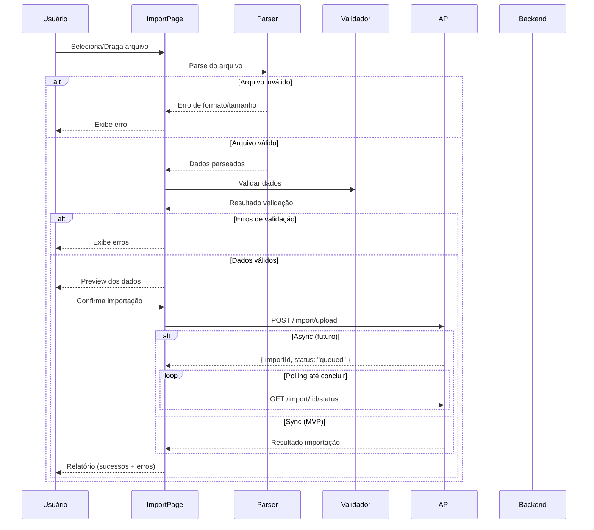

### 21.2 Isolamento para Processamento Assíncrono

A lógica de importação é projetada para que a troca de síncrono para assíncrono exija apenas:

1. Alterar a chamada de `POST /import/upload` para receber `importId`
2. Substituir o `await` direto por polling (ou WebSocket futuro)
3. A UI de progresso e resultado permanece a mesma

```typescript
// features/import/services/import-api.ts
// A abstração permite trocar a implementação sem
// modificar os componentes de UI

interface ImportStrategy {
  execute(file: File, onProgress?: (progress: number) => void): Promise<ImportResult>;
}

// Estratégia síncrona (MVP)
class SyncImportStrategy implements ImportStrategy {
  async execute(file: File): Promise<ImportResult> {
    const formData = new FormData();
    formData.append('file', file);
    const response = await httpClient.post(API_ENDPOINTS.IMPORT.UPLOAD, formData);
    return response.data;
  }
}

// Estratégia assíncrona (futuro)
class AsyncImportStrategy implements ImportStrategy {
  async execute(file: File, onProgress?: (progress: number) => void): Promise<ImportResult> {
    const { importId } = await httpClient.post(API_ENDPOINTS.IMPORT.UPLOAD, formData);
    // Polling ou WebSocket
    return this.pollStatus(importId, onProgress);
  }
}
```

### 21.3 Validação de Arquivo

| Validação            | Regra                          |
| -------------------- | ------------------------------ |
| Formato              | Apenas .csv e .xlsx            |
| Tamanho máximo       | 50MB                           |
| Linhas máximas       | 50.000                         |
| Encoding             | UTF-8 (CSV)                    |
| Colunas obrigatórias | Configurável por tipo de ficha |
| Duplicatas           | Detectadas por ID único        |

---

## 22. Fluxo de Monitoramento

### 22.1 Workflow de Monitoramento

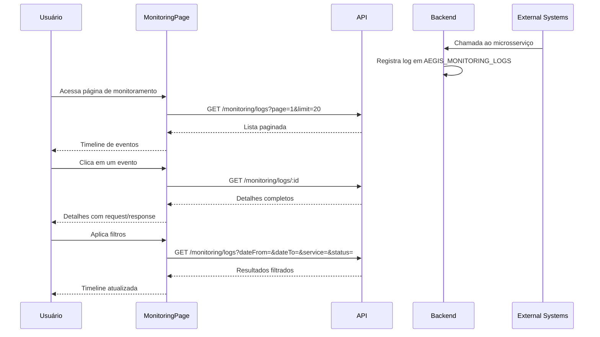

### 22.2 Componentes do Monitoring Timeline

- Timeline vertical com cards de evento
- Cada card mostra: status (badge), serviço, tempo de resposta, timestamp
- Expansão para ver detalhes completos
- Cores indicativas: verde (sucesso), vermelho (erro), amarelo (warning)
- Filtros no topo com apply explícito

---

## 23. Estratégia de Logging

### 23.1 Abstração de Logging

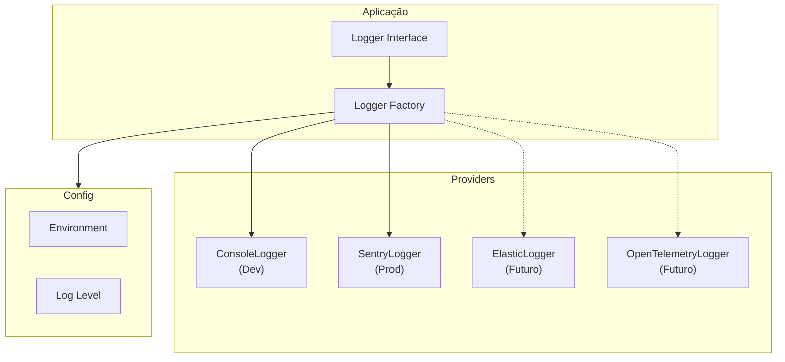

### 23.2 Interface de Logging

```typescript
// logging/logger.interface.ts
export interface Logger {
  debug(message: string, ...args: unknown[]): void;
  info(message: string, ...args: unknown[]): void;
  warn(message: string, ...args: unknown[]): void;
  error(message: string, error?: Error, ...args: unknown[]): void;
  fatal(message: string, error?: Error, ...args: unknown[]): void;
}

export type LogLevel = 'debug' | 'info' | 'warn' | 'error' | 'fatal';
```

### 23.3 Sentry (MVP)

```typescript
// logging/sentry-logger.ts
export class SentryLogger implements Logger {
  debug(message: string, ...args: unknown[]): void {
    // Sentry não tem debug, usamos console no dev
    if (config.env === 'development') {
      console.debug(message, ...args);
    }
  }

  error(message: string, error?: Error, ...args: unknown[]): void {
    Sentry.captureException(error || new Error(message), {
      extra: { message, args },
    });
  }

  // ...
}
```

### 23.4 Uso na Aplicação

```typescript
// Em vez de console.log direto
import { logger } from '@/logging';

logger.info('Import completed', { recordCount: 150, errors: 2 });
logger.error('Failed to disable lock', error, { lockId: '123' });
```

A abstração permite trocar o provider sem alterar código da aplicação.

---

## 24. Roadmap de Desenvolvimento

### 24.1 Milestones

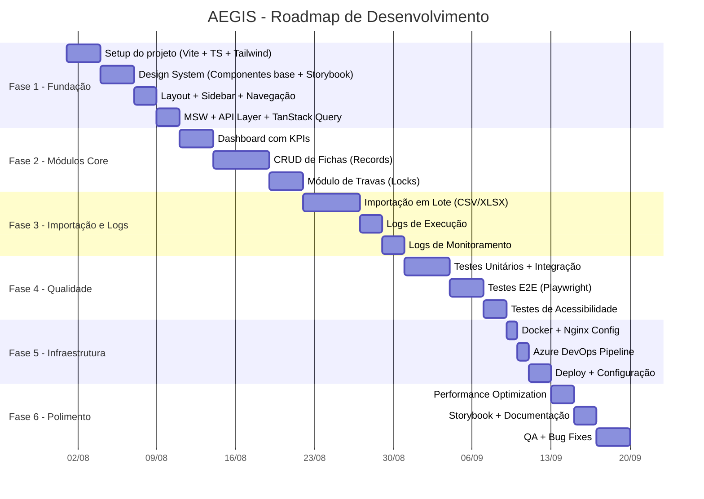

### 24.2 Fases Detalhadas

#### Fase 1: Fundação (Dias 1-5)

| Dia | Atividades                                                                                 | Entregas           |
| --- | ------------------------------------------------------------------------------------------ | ------------------ |
| 1   | Scaffold Vite + React + TS, configuração ESLint/Prettier/Husky, setup Tailwind + PostCSS   | Projeto rodando    |
| 2   | Design System base: Button, Input, Badge, Card, Skeleton, Toast, Modal                     | 7 componentes      |
| 3   | Design System complementar: DataTable, Select, Tabs, Drawer, Pagination, Tooltip, Dropdown | +7 componentes     |
| 4   | Layout principal (Sidebar + TopBar + Breadcrumb), Rotas, Lazy Loading, Providers           | Layout funcional   |
| 5   | Axios config, interceptors, MSW setup, TanStack Query, endpoints, Error handling           | API Layer completa |

#### Fase 2: Módulos Core (Dias 6-13)

| Dia | Atividades                                                    |
| --- | ------------------------------------------------------------- |
| 6   | Dashboard: layout, cards, KPIs, loading skeleton, empty state |
| 7   | Records: listagem, tabela, paginação, ordenação               |
| 8   | Records: filtros, busca, drawer de detalhes                   |
| 9   | Records: formulário criar/editar com React Hook Form + Zod    |
| 10  | Records: delete com confirmação, toast notifications          |
| 11  | Locks: listagem, tabela, filtros, paginação                   |
| 12  | Locks: detalhes modal, desativar trava com confirmação        |
| 13  | Busca global, refinamentos                                    |

#### Fase 3: Importação e Logs (Dias 14-22)

| Dia | Atividades                                            |
| --- | ----------------------------------------------------- |
| 14  | Import: UploadArea com dropzone, validação de arquivo |
| 15  | Import: Parser CSV (PapaParse) e XLSX (SheetJS)       |
| 16  | Import: Preview de dados, validação de colunas        |
| 17  | Import: Execução, progresso, relatório                |
| 18  | Execution Logs: listagem, filtros, paginação          |
| 19  | Execution Logs: drawer de detalhes, JSON viewer       |
| 20  | Monitoring: timeline, filtros, paginação              |
| 21  | Monitoring: detalhes, request/response viewer         |
| 22  | Monitoramento: refinar UX dos filtros                 |

#### Fase 4: Qualidade (Dias 23-28)

Standard testing phase.

#### Fase 5: Infraestrutura (Dias 29-31)

Docker e pipeline.

#### Fase 6: Polimento (Dias 32-36)

Performance, documentação, QA.

---

## 25. Estratégia de Testes

### 25.1 Pirâmide de Testes

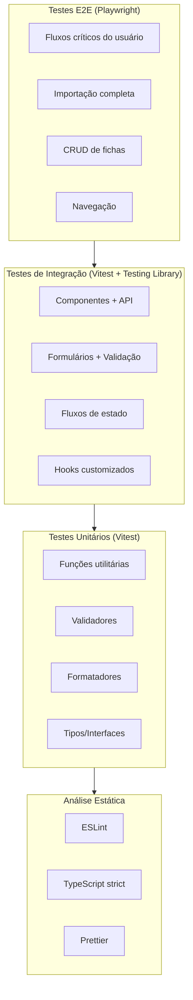

### 25.2 Cobertura de Testes por Tipo

| Tipo           | Ferramenta               | Cobertura | O que testar                                      |
| -------------- | ------------------------ | --------- | ------------------------------------------------- |
| Unitário       | Vitest                   | > 80%     | Utilitários, validadores, hooks puros, formatação |
| Integração     | Vitest + Testing Library | > 70%     | Componentes, formulários, fluxos de dados         |
| E2E            | Playwright               | Crítico   | Fluxos principais, importação, navegação          |
| Acessibilidade | axe + Playwright         | Crítico   | Páginas principais, componentes                   |
| Performance    | Lighthouse CI            | Alvo > 90 | Bundle, renderização                              |

### 25.3 Configuração de Testes

```typescript
// vitest.config.ts
export default defineConfig({
  test: {
    globals: true,
    environment: 'jsdom',
    setupFiles: ['./src/test/setup.ts'],
    include: ['src/**/*.{spec,test}.{ts,tsx}'],
    coverage: {
      provider: 'v8',
      reporter: ['text', 'json', 'html'],
      thresholds: {
        statements: 80,
        branches: 75,
        functions: 80,
        lines: 80,
      },
      exclude: ['src/**/*.stories.{ts,tsx}', 'src/mocks/**', 'src/test/**', 'src/types/**'],
    },
  },
});
```

### 25.4 Testes E2E (Playwright)

```typescript
// playwright.config.ts
export default defineConfig({
  testDir: './e2e',
  fullyParallel: true,
  forbidOnly: !!process.env.CI,
  retries: process.env.CI ? 2 : 0,
  workers: process.env.CI ? 1 : undefined,
  reporter: [['html'], ['list']],
  use: {
    baseURL: process.env.BASE_URL || 'http://localhost:5173',
    trace: 'on-first-retry',
  },
  projects: [
    { name: 'chromium', use: { ...devices['Desktop Chrome'] } },
    { name: 'firefox', use: { ...devices['Desktop Firefox'] } },
    { name: 'mobile-chrome', use: { ...devices['Pixel 5'] } },
  ],
});
```

### 25.5 Testes de Acessibilidade

```typescript
// Componente com axe
import { axe, toHaveNoViolations } from 'jest-axe';

expect.extend(toHaveNoViolations);

it('should not have accessibility violations', async () => {
  const { container } = render(<Button>Click me</Button>);
  const results = await axe(container);
  expect(results).toHaveNoViolations();
});
```

---

## 26. Estratégia de Deploy

### 26.1 Docker Multi-Stage Build

O build de produção segue multi-stage:

```
Stage 1: Build (node:20-alpine)
  → Instalar dependências
  → Build Vite (produção)
  → Gerar relatório de tamanho

Stage 2: Runtime (nginx:alpine)
  → Copiar build do stage 1
  → Copiar nginx.conf personalizado
  → Healthcheck
  → Expor porta 80
```

### 26.2 Estratégia de Deploy

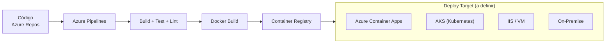

### 26.3 Pipeline CI/CD (Azure DevOps)

```yaml
# .azuredevops/azure-pipelines.yml
# Ver arquivo completo no repositório

stages:
  - stage: Quality
    displayName: 'Code Quality'
    jobs:
      - job: lint
      - job: typecheck
      - job: unit_test
      - job: build_check

  - stage: Test
    displayName: 'Tests'
    jobs:
      - job: integration_test
      - job: e2e_test

  - stage: Build
    displayName: 'Build & Push Docker'
    jobs:
      - job: docker_build

  - stage: Deploy
    displayName: 'Deploy'
    jobs:
      - deployment: deploy
```

### 26.4 Healthcheck

```nginx
# Nginx healthcheck endpoint
location /health {
    access_log off;
    return 200 "healthy\n";
    add_header Content-Type text/plain;
}
```

---

## 27. Riscos e Mitigação

| Risco                                          | Probabilidade | Impacto | Mitigação                                             |
| ---------------------------------------------- | ------------- | ------- | ----------------------------------------------------- |
| Backend não está pronto                        | Alta          | Alto    | MSW para mock total da API, dev independente          |
| Dados de tabelas com milhões de registros      | Média         | Alto    | Paginação server-side + virtualização desde o início  |
| Mudanças no schema do banco                    | Média         | Médio   | Tipos centralizados, contratos de API versionados     |
| Performance de importação com arquivos grandes | Alta          | Alto    | Parsing em Web Worker, processamento em chunks        |
| Requisitos de acessibilidade não atendidos     | Média         | Alto    | Testes de acessibilidade automatizados desde o início |
| Vazamento de memória em tabelas grandes        | Média         | Médio   | TanStack Virtual com cleanup, perf monitoring         |
| Falha de segurança (XSS, CSRF)                 | Baixa         | Alto    | CSP headers, sanitização, revisão de segurança        |
| Alteração no layout/responsividade             | Média         | Médio   | Testes responsivos no Playwright                      |
| Time terceiro alterando APIs sem aviso         | Média         | Alto    | Versionamento de API explícito, testes de contrato    |
| Onboarding lento de novos devs                 | Média         | Médio   | Storybook, Plop generators, documentação              |

---

## 28. Boas Práticas

### 28.1 TypeScript Strict Mode

```json
{
  "compilerOptions": {
    "strict": true,
    "noUncheckedIndexedAccess": true,
    "exactOptionalPropertyTypes": true,
    "noUnusedLocals": true,
    "noUnusedParameters": true,
    "noFallthroughCasesInSwitch": true,
    "forceConsistentCasingInFileNames": true
  }
}
```

### 28.2 Padrões de Código

| Padrão             | Regra                                                                                                     |
| ------------------ | --------------------------------------------------------------------------------------------------------- |
| **Naming**         | Components PascalCase, hooks camelCase(`use` prefix), types PascalCase, utils camelCase, files kebab-case |
| **Imports**        | Ordem: React → libs → components → hooks → services → types → utils → styles                              |
| **Exports**        | Named exports sempre (evitar default exports)                                                             |
| **Tamanho**        | Componente max 200 linhas, hook max 100 linhas                                                            |
| **Comentários**    | Apenas quando revelam "porquê", não "o quê"                                                               |
| **CSS**            | TailwindCSS utility classes + CSS variables para tokens                                                   |
| **Error Handling** | Tratamento centralizado, evitar try/catch espalhados                                                      |
| **Async**          | TanStack Query para async, evitar useEffect para data fetching                                            |

### 28.3 Padrões de Componente

```typescript
// Padrão de componente
interface ComponentProps {
  // Props tipadas
}

export function Component({ prop1, prop2 }: ComponentProps) {
  // 1. Hooks (useState, useEffect, custom hooks)
  // 2. Event handlers
  // 3. Render
  return <div>...</div>;
}
```

---

## 29. Melhorias Futuras

### 29.1 Curto Prazo (Pós-MVP)

| Melhoria                               | Esforço | Impacto |
| -------------------------------------- | ------- | ------- |
| Exportação de dados (CSV, Excel, PDF)  | Médio   | Alto    |
| Tema claro                             | Baixo   | Médio   |
| Histórico de importações               | Médio   | Alto    |
| Relatório de erros detalhado           | Médio   | Alto    |
| PWA + Service Worker (offline parcial) | Alto    | Médio   |
| Atalhos de teclado avançados           | Baixo   | Médio   |

### 29.2 Médio Prazo

| Melhoria                                   | Esforço | Impacto |
| ------------------------------------------ | ------- | ------- |
| Autenticação LDAP                          | Alto    | Alto    |
| RBAC completo                              | Alto    | Alto    |
| Notificações em tempo real (WebSocket/SSE) | Alto    | Alto    |
| Internacionalização (EN, ES)               | Médio   | Alto    |
| Dashboard com gráficos e trends            | Alto    | Alto    |
| Histórico de auditoria                     | Alto    | Médio   |
| Visualização de health integrada (Grafana) | Médio   | Alto    |

### 29.3 Longo Prazo

| Melhoria                                    | Esforço    | Impacto |
| ------------------------------------------- | ---------- | ------- |
| Modo escuro customizável pelo usuário       | Médio      | Baixo   |
| Relatórios agendados por email              | Alto       | Médio   |
| Integração com sistemas externos (webhooks) | Alto       | Alto    |
| Mobile app (React Native)                   | Muito Alto | Médio   |
| Dashboard customizável por usuário          | Alto       | Alto    |
| Modo offline completo                       | Muito Alto | Alto    |

---

## 30. Decisões Arquiteturais e Melhorias Aprovadas

### 30.1 Resumo das Melhorias Incorporadas

| #   | Melhoria                      | Justificativa                                                  | Impacto no MVP              |
| --- | ----------------------------- | -------------------------------------------------------------- | --------------------------- |
| 1   | **MSW (Mock Service Worker)** | Desenvolvimento independente do backend, testes realistas      | +1 dia setup inicial        |
| 2   | **Storybook**                 | Documentação visual do design system, testes de acessibilidade | +1 dia setup + manutenção   |
| 3   | **MSW + Storybook**           | Componentes com dados mockados vivos na documentação           | Já incluído nos itens 1 e 2 |
| 4   | **Plop.js**                   | Geração automática de features, redução de boilerplate         | +1/2 dia setup              |
| 5   | **Changesets**                | Versionamento semântico, changelog automático                  | +1/2 dia setup              |
| 6   | **Sentry no MVP**             | Monitoramento de erros desde o primeiro deploy                 | +1/2 dia integração         |
| 7   | **PWA preparado**             | Cache offline, instalação como app                             | +1 dia configuração         |
| 8   | **CSP Headers**               | Segurança contra XSS desde o início                            | Configuração no nginx       |
| 9   | **Azure Pipelines CI/CD**     | Pipeline de qualidade contínua                                 | +1 dia setup                |
| 10  | **API Versioning**            | Versionamento explícito nas URLs                               | Padrão de nomenclatura      |

### 30.2 Stack Tecnológica Final

| Categoria            | Tecnologia                 | Versão |
| -------------------- | -------------------------- | ------ |
| **Framework**        | React                      | 18.x   |
| **Linguagem**        | TypeScript                 | 5.x    |
| **Build**            | Vite                       | 5.x    |
| **Roteamento**       | React Router               | 6.x    |
| **Server State**     | TanStack Query             | 5.x    |
| **Estilos**          | TailwindCSS                | 3.x    |
| **Design System**    | shadcn/ui (customizado)    | Latest |
| **Ícones**           | Lucide React               | Latest |
| **Formulários**      | React Hook Form + Zod      | Latest |
| **HTTP Client**      | Axios                      | 1.x    |
| **CSV**              | PapaParse                  | Latest |
| **XLSX**             | SheetJS (xlsx)             | Latest |
| **Virtualização**    | TanStack Virtual           | Latest |
| **Animações**        | Framer Motion              | 11.x   |
| **Mock API**         | MSW (Mock Service Worker)  | 2.x    |
| **Storybook**        | Storybook                  | 8.x    |
| **Code Generator**   | Plop.js                    | Latest |
| **Versionamento**    | Changesets                 | Latest |
| **Error Tracking**   | Sentry                     | Latest |
| **PWA**              | vite-plugin-pwa            | Latest |
| **Linting**          | ESLint (flat config)       | 9.x    |
| **Formatter**        | Prettier                   | Latest |
| **Git Hooks**        | Husky + lint-staged        | Latest |
| **Testes Unitários** | Vitest + Testing Library   | Latest |
| **Testes E2E**       | Playwright                 | Latest |
| **Acessibilidade**   | axe + @axe-core/playwright | Latest |
| **CI/CD**            | Azure Pipelines            | -      |
| **Container**        | Docker (Nginx alpine)      | Latest |

---

## Apêndices

### A. Glossário

| Termo                     | Definição                                            |
| ------------------------- | ---------------------------------------------------- |
| **Ficha**                 | Registro de incidente no sistema                     |
| **Trava**                 | Lock de incidente, impedindo processamento duplicado |
| **Travas Ativas**         | Locks em vigor                                       |
| **Travas Desativadas**    | Locks removidos manualmente                          |
| **Importação em Lote**    | Upload de múltiplos registros via arquivo            |
| **Logs de Execução**      | Logs gerados pelo processamento de travas            |
| **Logs de Monitoramento** | Logs de requisições de sistemas externos             |
| **RBAC**                  | Role-Based Access Control                            |
| **CSP**                   | Content Security Policy                              |
| **MSW**                   | Mock Service Worker                                  |

### B. Referências

- [React Documentation](https://react.dev/)
- [Vite Documentation](https://vitejs.dev/)
- [TanStack Query Documentation](https://tanstack.com/query/latest)
- [TailwindCSS Documentation](https://tailwindcss.com/docs)
- [shadcn/ui Documentation](https://ui.shadcn.com/)
- [MSW Documentation](https://mswjs.io/)
- [Storybook Documentation](https://storybook.js.org/)
- [Playwright Documentation](https://playwright.dev/)
- [WCAG 2.1](https://www.w3.org/TR/WCAG21/)
- [Azure Pipelines Documentation](https://learn.microsoft.com/en-us/azure/devops/pipelines/)

### C. Convenções de Commit

```
feat:     Nova funcionalidade
fix:      Correção de bug
refactor: Refatoração de código
perf:     Melhoria de performance
test:     Adição ou modificação de testes
docs:     Documentação
chore:    Tarefas de infraestrutura
style:    Formatação, estilo
ci:       Pipeline / CI
```

Padrão: `tipo(escopo): descrição` — ex: `feat(records): add server-side pagination`
