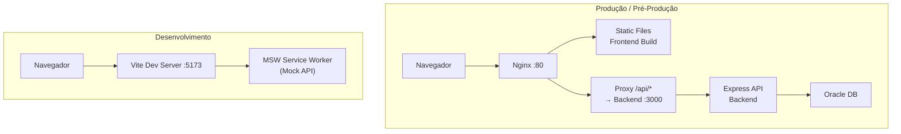

# AEGIS

Frontend enterprise para gerenciamento de travas de incidentes.

---

## Índice

1. [Arquitetura](#1-arquitetura)
2. [Pré-requisitos](#2-pré-requisitos)
3. [Configuração de Ambiente](#3-configuração-de-ambiente)
4. [Modo Desenvolvimento (MSW)](#4-modo-desenvolvimento-msw)
5. [Modo Pré-Produção (Banco Real)](#5-modo-pré-produção-banco-real)
6. [Docker (Produção)](#6-docker-produção)
7. [Variáveis de Ambiente](#7-variáveis-de-ambiente)
8. [Estrutura do Projeto](#8-estrutura-do-projeto)

---

## 1. Arquitetura



### Fluxo de requisição (pré-prod/produção)

```
Browser → Nginx (/api/v1/fichas) → Backend (:3000) → Oracle DB
```

### Fluxo de requisição (desenvolvimento)

```
Browser → Vite (:5173) /api/v1/fichas → MSW intercepta → Mock JSON
```

---

## 2. Pré-requisitos

| Ferramenta                 | Versão         |
| -------------------------- | -------------- |
| Node.js                    | >= 20          |
| pnpm                       | >= 9           |
| Docker (opcional)          | >= 24          |
| Oracle Database (pré-prod) | 19c+ ou XE 21c |

---

## 3. Configuração de Ambiente

### 3.1 Frontend

Arquivo: **`.env.development`** (já configurado para dev com MSW)

```env
# Frontend usa URL relativa — o proxy do Vite ou Nginx faz o encaminhamento
VITE_API_URL=/api/v1
VITE_FF_ENABLE_MOCK_API=true   # true = MSW mock, false = backend real
```

Para pré-produção, copie `.env.production` ou crie um `.env.preproduction`:

```env
VITE_API_URL=/api/v1
VITE_API_TIMEOUT=30000
VITE_APP_NAME=AEGIS
VITE_ENV=production
VITE_FF_ENABLE_MOCK_API=false   # ← DESLIGAR MSW
VITE_FF_ENABLE_GLOBAL_SEARCH=true
VITE_PWA_ENABLED=true
```

> ⚠️ **`VITE_FF_ENABLE_MOCK_API=false`** é a chave para usar o banco real. Com `true`, o MSW intercepta todas as chamadas e nenhuma requisição chega ao backend.

### 3.2 Backend — Conexão com Oracle (REAL)

Arquivo: **`backend/.env`** (criar a partir de `backend/.env.example`)

```env
# =============================================================================
# ONDE COLOCAR OS DADOS DE CONEXÃO COM O BANCO REAL
# =============================================================================

# Usuário do banco (deve ter acesso às tabelas AEGIS_*)
ORACLE_USER=AEGIS

# Senha do usuário do banco
ORACLE_PASSWORD=sua_senha_aqui

# String de conexão Oracle no formato: host:porta/servico
# Exemplos:
#   Oracle XE local:     localhost:1521/XEPDB1
#   Servidor remoto:     db.corp.internal:1521/AEGISPDB
#   RAC / VIP:           scan-cluster.corp:1521/AEGIS
ORACLE_CONNECTION_STRING=localhost:1521/XEPDB1

# Pool de conexões (ajuste conforme sua base)
DB_POOL_MIN=2
DB_POOL_MAX=10
DB_POOL_INCREMENT=1

# Porta do backend
PORT=3000
LOG_LEVEL=info
```

> ⚠️ A string de conexão Oracle deve apontar para um servidor Oracle com as tabelas `AEGIS_FICHAS` e `AEGIS_TRAVAS` já criadas (veja `backend/init-scripts/01-create-tables.sql`).

---

## 4. Modo Desenvolvimento (MSW)

Neste modo, **nenhuma conexão com banco é necessária**. O MSW intercepta todas as requisições e retorna dados mockados.

```bash
# 1. Instalar dependências do frontend
pnpm install

# 2. Iniciar dev server (Vite + MSW ativo)
pnpm run dev

# 3. Abrir http://localhost:5173
```

O MSW é ativado por `VITE_FF_ENABLE_MOCK_API=true` no `.env.development`.

Para ver os dados mockados:

- **Dashboard**: KPIs fixos + atividades recentes
- **Fichas**: 1250 registros gerados dinamicamente com paginação
- **Travas**: 20 travas mockadas com status variados
- **Logs/Import/Monitoring**: Placeholders (Fase 3)

---

## 5. Modo Pré-Produção (Banco Real)

### 5.1 Backend

```bash
cd backend

# 1. Criar arquivo de ambiente com suas credenciais Oracle
cp .env.example .env
# Editar .env com seus dados reais de banco
#   ORACLE_USER, ORACLE_PASSWORD, ORACLE_CONNECTION_STRING

# 2. Instalar dependências
npm install

# 3. Compilar TypeScript
npm run build

# 4. Iniciar backend
npm start
# Servidor em http://localhost:3000
# Healthcheck: http://localhost:3000/health
```

### 5.2 Frontend

```bash
# 1. Criar env de pré-produção
cp .env.production .env.preproduction

# 2. Ajustar VITE_FF_ENABLE_MOCK_API=false

# 3. Build de produção
pnpm run build

# 4. Servir os arquivos estáticos
# Opção A: Com Nginx (conf em .docker/nginx.conf)
# Opção B: Preview com Vite
pnpm run preview
```

### 5.3 Verificando a conexão

```bash
# Testar se o backend está respondendo
curl http://localhost:3000/health
# → {"status":"healthy","uptime":123.45,"lastCheck":"2026-..."}

# Testar listagem de fichas
curl http://localhost:3000/api/v1/fichas?page=1&limit=5
# → {"data":[...],"pagination":{...}}

# Testar listagem de travas
curl http://localhost:3000/api/v1/travas?page=1&limit=5
# → {"data":[...],"pagination":{...}}
```

> ⚠️ O backend usa `node-oracledb` em **Thin Mode** (não precisa de Oracle Instant Client instalado). Funciona diretamente com Node.js 20+.

---

## 6. Docker (Produção)

### 6.1 Subindo tudo (frontend + backend + oracle)

```bash
# Iniciar todos os serviços
docker compose up -d

# Ver logs
docker compose logs -f

# Parar
docker compose down
```

### 6.2 Configuração das variáveis no Docker

```bash
# Opção 1: Usar arquivo .env na raiz do projeto
echo "ORACLE_USER=AEGIS" >> .env
echo "ORACLE_PASSWORD=minha_senha" >> .env
echo "ORACLE_CONNECTION_STRING=oracle-db:1521/XEPDB1" >> .env
echo "PORT=8080" >> .env

# Opção 2: Passar inline
ORACLE_PASSWORD=minha_senha docker compose up -d
```

### 6.3 Serviços do Docker Compose

| Serviço     | Imagem                 | Porta          |
| ----------- | ---------------------- | -------------- |
| `aegis-app` | Nginx (frontend build) | 80             |
| `aegis-api` | Node (backend)         | 3000 (interna) |
| `oracle-db` | Oracle XE 21c          | 1521           |

### 6.4 Apenas o frontend (se já tiver backend separado)

```bash
docker build -t aegis-frontend .
docker run -p 80:80 -e API_URL=http://meu-backend:3000 aegis-frontend
```

> A variável `API_URL` no container frontend é usada pelo Nginx no **CSP header** (`connect-src`). A comunicação real com o backend é feita via proxy reverso no próprio Nginx (`location /api/ → proxy_pass`).

---

## 7. Variáveis de Ambiente

### 7.1 Frontend (prefixo `VITE_`)

| Variável                  | Obrigatório | Padrão        | Descrição                                 |
| ------------------------- | ----------- | ------------- | ----------------------------------------- |
| `VITE_API_URL`            | Sim         | `/api/v1`     | URL base da API (relativa em produção)    |
| `VITE_ENV`                | Sim         | `development` | `development`, `production`, `staging`    |
| `VITE_FF_ENABLE_MOCK_API` | Sim         | `true`        | `true` = MSW mock, `false` = backend real |
| `VITE_API_TIMEOUT`        | Não         | `30000`       | Timeout das requisições (ms)              |
| `VITE_SENTRY_DSN`         | Não         | vazio         | DSN do Sentry para error tracking         |
| `VITE_PWA_ENABLED`        | Não         | `false`       | Habilitar service worker PWA              |
| `VITE_POLLING_INTERVAL`   | Não         | `30000`       | Intervalo de polling (ms)                 |

### 7.2 Backend

| Variável                   | Obrigatório | Padrão                  | Descrição                                       |
| -------------------------- | ----------- | ----------------------- | ----------------------------------------------- |
| `ORACLE_USER`              | **Sim**     | `AEGIS`                 | Usuário Oracle                                  |
| `ORACLE_PASSWORD`          | **Sim**     | `aegis123`              | Senha Oracle                                    |
| `ORACLE_CONNECTION_STRING` | **Sim**     | `localhost:1521/XEPDB1` | String de conexão Oracle                        |
| `DB_POOL_MIN`              | Não         | `2`                     | Mínimo de conexões no pool                      |
| `DB_POOL_MAX`              | Não         | `10`                    | Máximo de conexões no pool                      |
| `PORT`                     | Não         | `3000`                  | Porta do servidor                               |
| `LOG_LEVEL`                | Não         | `info`                  | Nível de log (`debug`, `info`, `warn`, `error`) |

---

## 8. Estrutura do Projeto

```
aegis/
├── backend/                          # API Express + Oracle
│   ├── src/
│   │   ├── config/database.ts        # Pool de conexões Oracle
│   │   ├── services/
│   │   │   ├── fichas.service.ts     # SQL: SELECT/INSERT AEGIS_FICHAS
│   │   │   ├── travas.service.ts     # SQL: SELECT AEGIS_TRAVAS
│   │   │   └── dashboard.service.ts  # SQL: KPIs + health
│   │   ├── controllers/
│   │   ├── middleware/pagination.ts  # ?page=&limit=&search=
│   │   └── routes/
│   ├── init-scripts/                 # DDL + seed para Oracle
│   │   ├── 01-create-tables.sql
│   │   └── 02-seed-data.sql
│   ├── Dockerfile
│   └── .env.example                  # Template de config
├── src/                              # Frontend React + Vite
│   ├── features/
│   │   ├── dashboard/                # Dashboard com KPIs
│   │   ├── records/                  # CRUD AEGIS_FICHAS
│   │   ├── locks/                    # Listagem AEGIS_TRAVAS
│   │   ├── import/                   # Placeholder (Fase 3)
│   │   ├── execution-logs/           # Placeholder (Fase 3)
│   │   └── monitoring/               # Placeholder (Fase 3)
│   ├── mocks/handlers/               # MSW (mock para dev)
│   └── services/http-client.ts       # Axios + interceptors
├── .docker/nginx.conf                # Nginx com proxy reverso
├── docker-compose.yml                 # 3 serviços (front + back + oracle)
├── Dockerfile                         # Frontend multi-stage
└── .env.development / .env.production
```

---

## Quick Reference — Check-List Pré-Produção

- [ ] `VITE_FF_ENABLE_MOCK_API=false` no `.env` do frontend
- [ ] `ORACLE_USER`, `ORACLE_PASSWORD`, `ORACLE_CONNECTION_STRING` no `backend/.env`
- [ ] Tabelas `AEGIS_FICHAS` e `AEGIS_TRAVAS` existem no banco
- [ ] Backend compilado: `cd backend && npm run build`
- [ ] Frontend compilado: `pnpm run build`
- [ ] Teste de conexão: `curl localhost:3000/health`
- [ ] Teste de dados: `curl localhost:3000/api/v1/fichas?page=1&limit=1`
